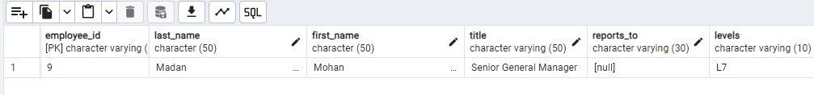
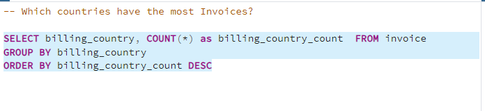
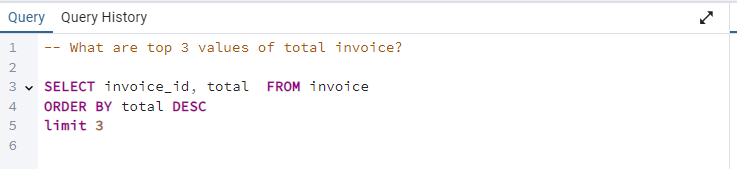
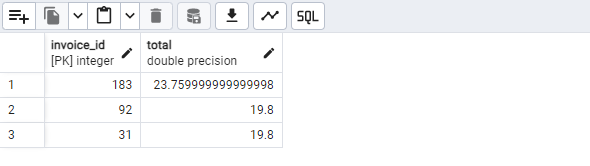
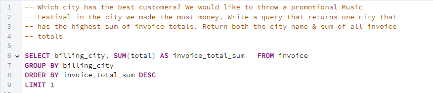
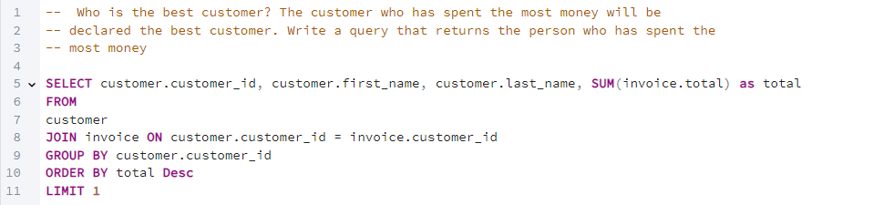
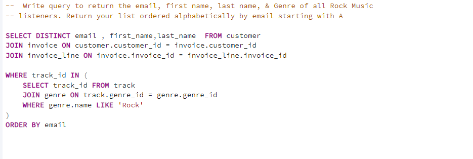
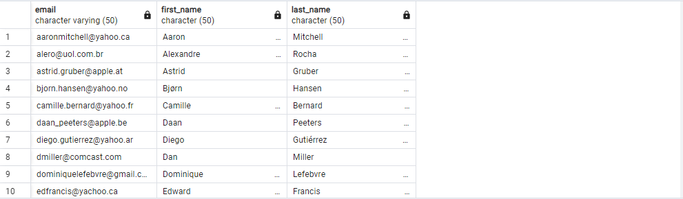

# Music Store Data Analysis with SQL
Author: Md Sobahan Mia

## Project Description
This project includes SQL queries to perform various data analysis tasks on a music store database. The queries are grouped by difficulty levels (Easy, Moderate, and Advanced) and tackle different questions related to customer and sales data. The objective is to gain insights into customer spending patterns, popular genres by country, and other relevant business metrics.

## Database and Tools
* Postgre SQL
* PgAdmin4

Schema- Music Store Database  

## Table of Contents
- [Data Requirements](#data-requirements)
- [Query Sections](#query-sections)
  - [Easy Queries](#easy-queries)
  - [Moderate Queries](#moderate-queries)
  - [Advanced Queries](#advanced-queries)
- [Usage](#usage)
- [Contributing](#contributing)
- [License](#license)

## Data Requirements
This project assumes the following tables in your database:
- `employee` - Contains employee data including `title`, `first_name`, `last_name`, and `levels`.
- `invoice` - Contains invoice details with fields like `invoice_id`, `customer_id`, `billing_country`, `billing_city`, and `total`.
- `customer` - Holds customer information such as `customer_id`, `first_name`, `last_name`, `email`, and `country`.
- `invoice_line` - Line items in invoices with fields such as `invoice_id`, `track_id`, `unit_price`, and `quantity`.
- `track` - Contains track details like `track_id`, `name`, `milliseconds`, and `genre_id`.
- `album` - Stores album data, including `album_id` and `artist_id`.
- `artist` - Contains artist information with `artist_id` and `name`.
- `genre` - Holds genre data including `genre_id` and `name`.

Ensure these tables are populated with appropriate data before running the queries.

## Query Sections

### Easy Queries
1. **Find the Senior Most Employee** - Finds the employee with the highest job level.
# Q1: Who is the senior most employee based on job title? 

#SELECT title, last_name, first_name 
#FROM employee
#ORDER BY levels DESC
#LIMIT 1

2. **Top Countries by Invoice Count** - Lists countries with the most invoices.

3. **Top Invoice Values** - Retrieves the top three invoice totals.

4. **City with Best Customers** - Determines the city with the highest total sales.

5. **Best Customer** - Finds the customer who has spent the most.

### Moderate Queries
1. **Identify Rock Music Listeners** - Retrieves details of customers who listen to Rock music, ordered alphabetically by email.

2. **Top Rock Music Artists** - Finds the top 10 artists by the number of Rock tracks.
3. **Tracks Longer Than Average** - Lists tracks longer than the average song length, ordered by duration.

### Advanced Queries
1. **Customer Spending on Artists** - Determines how much each customer spent on the most popular artist.
2. **Most Popular Genre by Country** - Finds the most popular music genre by country based on sales.
3. **Top Customer by Country** - Identifies the customer with the highest spending in each country.

## Usage
1. Clone the repository and load the SQL file into your database to set up the necessary schema and data.
2. Run the queries using your preferred SQL client.

Each query is divided by comment headers to help you locate specific questions easily. To test each query, load your music store dataset into the database and execute the queries one by one to review results.

## Contributing
Contributions are welcome! If you have any improvements or additional queries to suggest, please feel free to submit a pull request.

## License
This project is open-source and available under the MIT License. See the `LICENSE` file for details.
